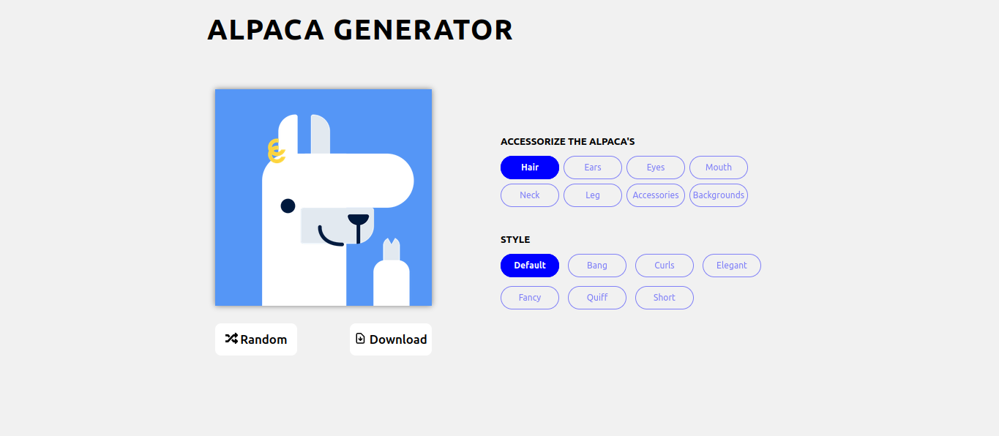

# DevProjects - Alpaca image generator website

This is an open source project from [DevProjects](http://www.codementor.io/projects). Feedback and questions are welcome!
Find the project requirements here: [Alpaca image generator website](https://www.codementor.io/projects/web/alpaca-image-generator-website-ce2oc0eus8)

## Tech/framework used

Built with [React](https://reactjs.org/)

## Screenshots and demo

## Installation

1. Run `git clone https://github.com/hex909/alpacaGenerator.git && cd alpacaGenerator`

2. Run `npm i`.

3. Run `npm run dev`.

## License

[MIT](https://choosealicense.com/licenses/mit/)
